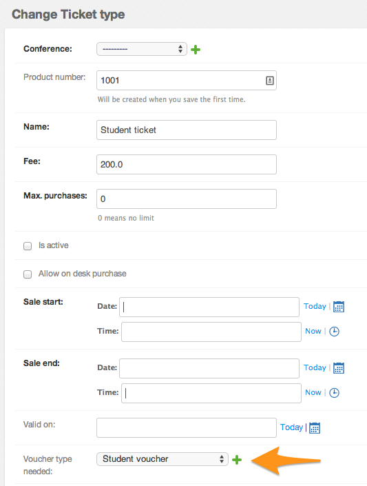

**********
Ticket-App
**********

The primary component of the ``attendees`` app is a simple ticket sale system.
You can configure multiple ``TicketType`` s that can have different additional
fields, have different prices, and may or may not require a certain kind of
voucher (``Voucher``) to be purchased. This way student or sponsor discounts are
handled. as these vouchers have to be explicitly generated.

Ticket types
============

The ticket types mentioned above also allow you to have different fields that
may or may not be mandatory or editable in the buyer's account panel. This is
handled by binding a ticket type with a subtype of the base "Ticket" model
class. This basic model features fields like the information you'd normally
expect to be printed onto a ticket, like a name, company or be related to the
ticket holder's dietary requirements/preferences.

Additionally, djep features ticket implementations for things like donations
or SIM cards. While they are not even remotely like tickets in the real world,
they *are* purchasable items and therefore similar to tickets within the context
of this app. This will most likely change eventually, though.

Vouchers
========

With vouchers you can restrict certain ticket types to be only purchasable for
certain customers. A concrete use-case here are student tickets:

Here we have a ticket type "Student ticket" for which you have to have a
voucher of of the type "Standard Student".

Vouchers have to be manually created in the admin area and can then be 
explicitly handed out to people after, for instance, receiving a photocopy of
a student card.

.. warning::
    
    If a ticket type requires a voucher to be purchased, then only one ticket
    of that type can be purchased with each order.

Payment options
===============

Right now, this apps supports payment via invoice and credit card. The latter
is handled by PayMill. If you want to, you can change the ``PAYMENT_METHODS``
setting (default: ``['invoice', 'creditcard']``) to disable either one of them.

For PayMill you also have to set a ``PAYMILL_PUBLIC_KEY`` and
``PAYMILL_PRIVATE_KEY`` which you can find in your account settings there.

