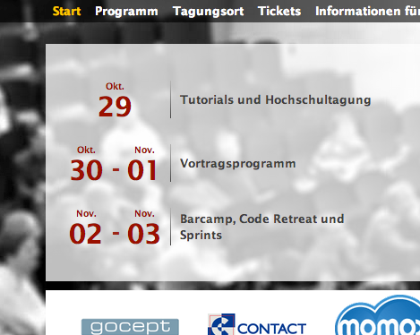

Events-App
==========

Über die Events-App können an bestimmten Stellen der Site Listen von Terminen
für die Konferenz geschalten werden, die mit Sessions und anderen konkreten
Ereignissen während der Konferenz nichts zu tun haben.

Für die PyCon DE 2012 waren das zum Beispiel die Zeitrahmen für die 3 großen
Blöcke der Konferenz (Tutorials & Hochschultagung, Vortragsprogramm und Barcamp 
/ Sprints / Code Retreat).

    
    2012 waren Events direkt im Header verankert und gaben einen groben
    Überblick über den Zeitplan der Konferenz.

Diese Events können über den Admin-Bereich global verwaltet und jeweils auch mit
einem Link hinterlegt werden, der dann durch den "list_events"-Tag im
Frontend ausgegeben wird.