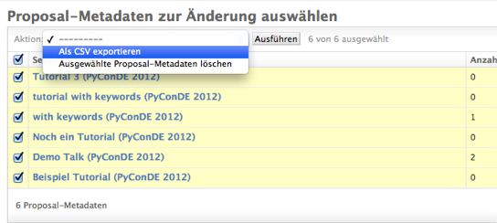

Reviews-App
===========

The review process
------------------

djep features a simple review process where reviewers can work their way through
all submitted proposals and given them a rating between -1 and +1. -1 means that
they don't think that a proposal should be part of the final schedule while +1
means it should be. There are also -0 and +0 give the reviewer the option to
incline towards one or the other.

The reviews themselves are not visible to the author of the proposal but only to
staff members and members of the program committee.

If the reviewer has questions for the original author they can submit them
through the "comments" field right below the proposal's text. The proposal
author receives a notification about that and can interact through this feature
with the reviewer.

If the proposal author then decides to edit a proposal e.g. due to feedback from
reviewers, a new version of the proposal is created and those reviewers that
already created a review are notified about the change.

Once the review phase is over (configurable through the conference model
instance) no reviews can be added or updated anymore.

Available views
---------------

The app provides a handful of views for proposal authors, reviewers and staff
members:

* List of available proposals currently reviewable. For staff members this also
  includes a cumulated score and a link to the actual reviews.
* List of reviews created the current user
* Proposal details: From this view the reviewer and author can communicate
  through comments and can access previous versions of a proposal. Reviewers can
  also access the review form to create or change a review.
* Review form: Form for creating and updating a review. There is also a button
  for deleting the review.
* Proposal version: Simplified view on a specific version of a proposal.

Export der bewerteten Proposals
-------------------------------

Zur einfacheren Auswertung der Proposals, können diese zusammen mit ihrem
aktuellen Score über den Admin-Bereich exportiert werden. Die entsprechende
Aktion befindet sich unter "/admin/reviews/proposalmetadata/".

Um hier nun sämtliche Proposals zu exportiert, wählt man zuerst sämtliche
Session-Vorschläge aus (hierzu gibt es auch einen Shortcut in der linken oberen
Ecke) und wählt dann unter "Aktionen" "Als CSV exportieren" aus:

    
    Proposals können über den Proposal-Metadata-Bereich zusammen mit dem
    aktuellen Score exportiert werden.

In diesem Export sind folgende Daten enthalten:

================ ===============================================================
Header           Beschreibung
================ ===============================================================
ID               ID des Proposals
Title            Aktueller Titel des Proposals
OriginalTitle    Ursprünglicher Titel wie er während der Proposal-Phase
                 eingetragen wurde
SpeakerUsername  Benutzername des Vortragenden
SpeakerName      Voller Name des Vortragenden wenn vorhanden, ansonsten
                 Benutzername
CoSpeakers       Voller Name der Co-Speaker mit "|" getrennt
AudienceLevel    Level
Duration         Dauer der Session
Track            Ausgewählter Track
Score            Gesammelter Score zur aktuellen Zeitpunkt
NumReviews       Anzahl der derzeit vorliegenden Reviews zu diesem Proposal
================ ===============================================================

Alternativ kann dieser Export auch über den Befehl "export_proposal_scores"
durchgeführt werden.
